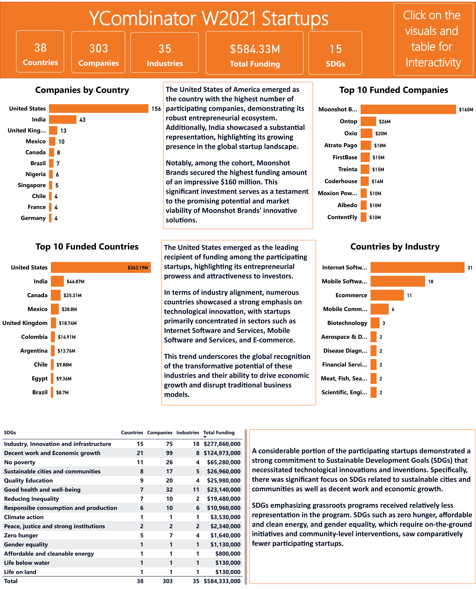

# YCombinator_w21_startup_funding

## **Introduction**

## This report presents an exploratory data analysis of the startups that participated in the YCombinator Winter 2021 accelerator program. 

## The analysis aims to provide insights into the characteristics of the participating startups, their industries and other relevant information.
 

## **Background**

## The Winter 2021 batch consisted of a diverse range of startups, representing various industries. 
## The funding program included startups from fields such as technology, healthcare, e-commerce and more.
## The solution of each participating startup were geared towards a sustainable development goal (SDGs). The number of participating startups for the winter 2021 cohort was approximately 303 

 

## **Exploratory Analysis**

##  Based on the provided dataset, here are some insights that can be derived for analysis and data reporting
 

## 1. **Industry Sector Analysis:** Categorizing the startups based on their industry sectors allows for an examination of the prevalence of certain sectors within the 2021 winter batch.
 

## 2. **Country Representation:** Analyzing the distribution of startups across different countries can reveal geagraphical trends and the global reach of the YCombinator program.
 

## 3. **Total Funding:** The total funding amount for each startup provides an indication of the level of financial support they have received.
 

## 4. **Sustainable Development Goals (SDGs):** The inclusion of SDGs allows for the analysis of the startups' aligment with sustainable development objectives. This analysis can provide insights into the focus areas and initiatives of the participating startups.

 

 

## **Findings**
## 1. For the winter 2021 Startups Accelerator Program, the United States of America emerged as the country with the highest number of participating nations, demonstrating its robust entrepreneurial ecosystem. Additionally, India showcased a substantial representation, highlighting its growing presence in the global startup landscape.

 

## 2. The emphasis on integrating SDGs into the business models of companies shows a growing trend within the startup ecosystem. By aligning their goals with global sustainability objectives, these startups are not only pursuing financial success but also contributing to addressing pressing societal and environmental challenges.

 

## 3. In terms of industry alignment, numerous countries showcased a strong emphasis on technological innovation, with startups primarily concentrated in sectors such as Internet Software and Services, Mobile Software and Services, and E-commerce. This trend underscores the global recognition of the transformative potential of these industries and their ability to drive economic growth and disrupt traditional business models

 

## **Recommendation**
## it is essential to recognize the ongoing need for increased participation and innovation in areas that are comparatively underrepresented. By encouraging startups to tackle these critical SDGs, the program can contribute to a more comprehensive and impactful approach towards sustainable development.

 

## **Conclusion**

## The exploratory data analysis of the YCombinator Winter 2021 startups provides valuable insights into the characteristics and diversity of the participating startups. It showcases the number of participating startups from around the world, the range of industry sectors, the sustainable development goals (SDGs) each company focused on as well as the amount of funding for each startup.